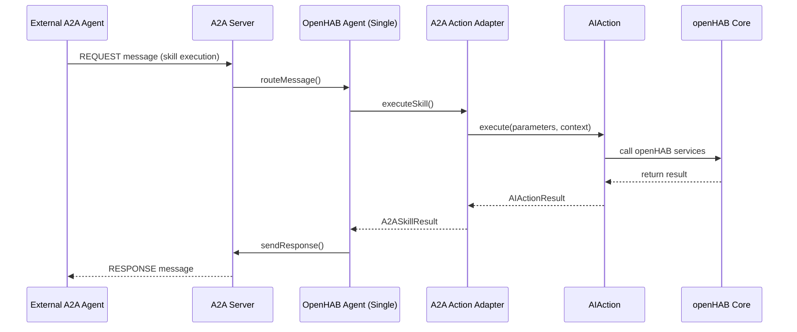

# A2A Skills Analysis and Architecture Insights - Updated 2024

## Overview

This document captures comprehensive insights from the analysis of how existing AIActions in the AI Common bundle can be leveraged for A2A (Agent-to-Agent) implementation in openHAB, along with identification of new A2A-specific skills needed for home automation.

**Key Paradigm Shift**: openHAB is analyzed as a **single agent with 68+ skills** (AIActions) communicating with **external agents**, rather than multiple agents within openHAB coordinating with each other.

## Table of Contents

1. [Bundle Organization Strategy](#bundle-organization-strategy)
2. [AIActions Relevance Analysis](#aiactions-relevance-analysis)
3. [A2A Protocol Analysis](#a2a-protocol-analysis)
4. [A2A Adapter Architecture](#a2a-adapter-architecture)
5. [A2A Protocol Provided Skills](#a2a-protocol-provided-skills)
6. [Missing A2A Skills for Single Agent](#missing-a2a-skills-for-single-agent)
7. [Implementation Recommendations](#implementation-recommendations)
8. [Key Differentiators](#key-differentiators)

---

## Bundle Organization Strategy

### Current AIActions Structure

The AIActions are currently organized in the `org.openhab.core.ai.common` bundle under:

```
org.openhab.core.ai.common/src/main/java/org/openhab/core/ai/common/actions/
├── items/          # Item management actions (20 actions)
├── things/         # Thing management actions (14 actions)  
├── channels/       # Channel management actions
├── rules/          # Rule management actions (17 actions)
├── config/         # Configuration actions (7 actions)
├── system/         # System management actions
├── security/       # Security actions (1 action)
├── filesystem/     # File system actions
├── scripts/        # Script management actions
├── persistence/    # Persistence actions (11 actions)
├── events/         # Event management actions (6 actions)
├── addons/         # Addon management actions
├── discovery/      # Discovery actions
├── monitoring/     # Monitoring actions (12 actions)
├── analytics/      # Analytics actions (1 action)
├── automation/     # Advanced automation actions (1 action)
├── network/        # Network management actions
└── resources/      # Resource management actions
```

### Recommended Organization for A2A Integration

**Option 1: Shared Action Bundle (Recommended)**
```
org.openhab.core.ai.common/
└── actions/        # Shared action implementations
    ├── items/
    ├── things/
    ├── channels/
    └── ...
```

**Option 2: Protocol-Specific Action Bundles**
```
org.openhab.core.ai.mcp/
└── actions/        # MCP-specific action adapters

org.openhab.core.ai.a2a/  
└── actions/        # A2A-specific action adapters

org.openhab.core.ai.common/
└── actions/        # Core action implementations
```

**Recommendation: Option 1** because:
- **Single Source of Truth**: Actions are implemented once and shared
- **Consistency**: Same behavior across protocols
- **Maintainability**: Changes propagate to both protocols
- **Testing**: Single test suite for core functionality

---

## AIActions Relevance Analysis

### 🔴 HIGH RELEVANCE - Core openHAB Operations

| **Action Category** | **Actions** | **Relevance** | **Rationale** |
|-------------------|-------------|---------------|---------------|
| **Items** | 20 actions (ListItems, GetItem, SetItemState, SendItemCommand, etc.) | **HIGH** | Core openHAB entities that external agents need to query and control |
| **Things** | 14 actions (ListThings, GetThing, ThingConfiguration, etc.) | **HIGH** | Physical devices that external agents need to manage and monitor |
| **Rules** | 17 actions (ListRules, CreateRule, ExecuteRule, GetRuleHistory, etc.) | **HIGH** | Automation logic that external agents need to understand and modify |
| **Events** | 6 actions (SubscribeEvents, SendEvent, EventSubscriptionRegistry, etc.) | **HIGH** | Real-time system events that external agents need to monitor |
| **Persistence** | 11 actions (QueryPersistence, GetPersistenceData, BackupPersistence, etc.) | **HIGH** | Historical data that external agents need to analyze |

### 🟡 MEDIUM RELEVANCE - System Management

| **Action Category** | **Actions** | **Relevance** | **Rationale** |
|-------------------|-------------|---------------|---------------|
| **Monitoring** | 12 actions (LoggingMonitoring, GetLogs, SearchLogs, GetAlerts, etc.) | **MEDIUM** | System health monitoring for external agent coordination |
| **Configuration** | 7 actions (ConfigurationBackup, ConfigurationExport, ConfigurationValidation, etc.) | **MEDIUM** | System configuration management for external agent deployment |
| **Security** | 1 action (SecurityManagement) | **MEDIUM** | Access control and authentication for external agent security |
| **System** | Various system management actions | **MEDIUM** | System operations for external agent coordination |
| **Filesystem** | File system operations | **MEDIUM** | File operations for external agent data exchange and storage |

### 🟠 LIMITED RELEVANCE - Protocol-Specific

| **Action Category** | **Actions** | **Relevance** | **Rationale** |
|-------------------|-------------|---------------|---------------|
| **Addons** | Addon management actions | **LOW** | Runtime management, limited external agent use |
| **Network** | Network management actions | **LOW** | Infrastructure management, limited external agent use |
| **Resources** | Resource management actions | **LOW** | Resource management, limited external agent use |

### 🔵 SPECIALIZED RELEVANCE - Advanced Features

| **Action Category** | **Actions** | **Relevance** | **Rationale** |
|-------------------|-------------|---------------|---------------|
| **Automation** | 1 action (AdvancedAutomation) | **HIGH** | Complex workflows that external agents can coordinate |
| **Analytics** | 1 action (DataAnalysis) | **HIGH** | Data analysis capabilities for external agent decision-making |
| **Discovery** | Discovery actions | **MEDIUM** | Device discovery for external agent coordination |
| **Scripts** | Script management actions | **MEDIUM** | Script execution for external agent automation |

---

## A2A Protocol Analysis

### A2A Protocol Characteristics

From the codebase analysis, A2A uses:
- **Message-based communication** with `A2AMessage` objects
- **Agent-centric architecture** with `A2AAgent` interfaces
- **Capability-based discovery** via `getCapabilities()` method
- **Request/Response pattern** with message types like `REQUEST`, `RESPONSE`
- **Priority-based routing** with `A2APriority` levels

### A2A Skills vs AIActions Mapping

| **A2A Concept** | **AIAction Concept** | **Mapping Strategy** |
|-----------------|---------------------|---------------------|
| **Agent Capabilities** | **Action Registry** | Direct mapping via adapter |
| **Skill Execution** | **Action Execution** | Delegate to AIAction.execute() |
| **Skill Discovery** | **Action Schema** | Use AIAction.getParameterSchema() |
| **Skill Validation** | **Action Validation** | Use AIAction.validateParameters() |
| **Skill Metadata** | **Action Metadata** | Use AIAction.getActionName() and getDescription() |

---

## A2A Adapter Architecture

### Core Components

```java
// 1. A2A Action Adapter
public class A2AActionAdapter implements A2ASkill {
    private final AIAction aiAction;
    private final String skillId;
    
    public A2AActionAdapter(AIAction aiAction) {
        this.aiAction = aiAction;
        this.skillId = "a2a." + aiAction.getActionId();
    }
    
    @Override
    public A2ASkillResult execute(A2AMessage request) {
        // Convert A2A message to AIAction parameters
        Map<String, Object> parameters = convertMessageToParameters(request);
        
        // Execute via AIAction
        AIActionResult result = aiAction.execute(parameters, createContext(request));
        
        // Convert AIAction result to A2A response
        return convertResultToA2A(result);
    }
}

// 2. A2A Skill Registry
public class A2ASkillRegistry {
    private final Map<String, A2ASkill> skills = new ConcurrentHashMap<>();
    private final AIActionRegistry aiActionRegistry;
    
    public void registerAIAction(AIAction action) {
        A2AActionAdapter adapter = new A2AActionAdapter(action);
        skills.put(adapter.getSkillId(), adapter);
    }
    
    public A2ASkillResult executeSkill(String skillId, A2AMessage request) {
        A2ASkill skill = skills.get(skillId);
        if (skill == null) {
            throw new SkillNotFoundException(skillId);
        }
        return skill.execute(request);
    }
}

// 3. A2A Agent Implementation
public class OpenHABAgent implements A2AAgent {
    private final A2ASkillRegistry skillRegistry;
    
    @Override
    public Map<String, Object> getCapabilities() {
        // Return available skills as capabilities
        return skillRegistry.getAvailableSkills();
    }
    
    @Override
    public void receiveMessage(A2AMessage message) {
        if (message.getMessageType() == A2AMessageType.REQUEST) {
            String skillId = extractSkillId(message);
            A2ASkillResult result = skillRegistry.executeSkill(skillId, message);
            sendResponse(message, result);
        }
    }
}
```

### Message Flow Architecture



### Aspects Not Covered in Both Directions

#### AIAction → A2A Gaps

1. **Asynchronous Operations**
   - **AIAction**: Primarily synchronous action execution
   - **A2A**: Supports async operations with correlation IDs
   - **Solution**: Add async wrapper for long-running AIActions

2. **Message Prioritization**
   - **AIAction**: No built-in priority system
   - **A2A**: Has `A2APriority` levels
   - **Solution**: Map A2A priority to AIAction execution priority

3. **Agent Discovery**
   - **AIAction**: Action discovery via registry
   - **A2A**: Agent capability discovery via `DISCOVERY` messages
   - **Solution**: Implement capability announcement in A2A agent

#### A2A → AIAction Gaps

1. **Multi-Agent Coordination**
   - **A2A**: Supports agent-to-agent coordination
   - **AIAction**: Single action execution model
   - **Solution**: Create AIActions for agent coordination

2. **Event Broadcasting**
   - **A2A**: Supports `broadcastMessage()` to all agents
   - **AIAction**: No built-in broadcasting
   - **Solution**: Implement AIAction notification system

3. **Stateful Agent Sessions**
   - **A2A**: Agents maintain state and sessions
   - **AIAction**: Stateless action execution
   - **Solution**: Add session management to AIAction context

---

## A2A Protocol Provided Skills

### ✅ **Already Implemented by A2A Protocol**

Based on analysis of the A2A bundle implementation, the following skills are **already provided** by the A2A protocol and SDK:

#### 1. **Core A2A Protocol Skills** ✅

| **Skill Category** | **Implementation** | **Status** |
|-------------------|-------------------|------------|
| **Agent Discovery** | `AgentCard`, `AgentCapabilities` in `A2AServerManager` | ✅ **PROVIDED** |
| **Skill Registration** | `A2ASkillRegistry` with `AgentSkill` mapping | ✅ **PROVIDED** |
| **Message Handling** | `RequestHandler` with `onMessageSend()` | ✅ **PROVIDED** |
| **Task Management** | `TaskStore` with task lifecycle management | ✅ **PROVIDED** |
| **Streaming Events** | `StreamingEventKind` with `SubmissionPublisher` | ✅ **PROVIDED** |
| **Security & Authentication** | `A2ASecurityManager` with role-based access | ✅ **PROVIDED** |
| **Persistence** | `A2APersistenceManager` with task persistence | ✅ **PROVIDED** |

#### 2. **External Agent Communication** ✅

| **Skill Category** | **Implementation** | **Status** |
|-------------------|-------------------|------------|
| **External Agent Discovery** | `AgentCard.getAgentCard()` | ✅ **PROVIDED** |
| **Capability Advertising** | `AgentCapabilities.buildCapabilities()` | ✅ **PROVIDED** |
| **Skill Exposition** | `AgentSkill` mapping from AIActions | ✅ **PROVIDED** |
| **Message Routing** | `RequestHandler` message routing | ✅ **PROVIDED** |
| **Task Execution** | `TaskStore` with async execution | ✅ **PROVIDED** |
| **Event Publishing** | `StreamingEventKind` publishers | ✅ **PROVIDED** |

#### 3. **Security & Access Control** ✅

| **Skill Category** | **Implementation** | **Status** |
|-------------------|-------------------|------------|
| **Authentication** | `A2ASecurityManager.authenticateA2AMessage()` | ✅ **PROVIDED** |
| **Authorization** | `A2ASecurityManager.hasA2APermission()` | ✅ **PROVIDED** |
| **Rate Limiting** | `A2ASecurityManager.checkRateLimit()` | ✅ **PROVIDED** |
| **Audit Logging** | `AIAuditLogger` integration | ✅ **PROVIDED** |
| **Session Management** | Client session tracking | ✅ **PROVIDED** |

#### 4. **Task & Workflow Management** ✅

| **Skill Category** | **Implementation** | **Status** |
|-------------------|-------------------|------------|
| **Task Creation** | `TaskStore.save()` | ✅ **PROVIDED** |
| **Task Execution** | `RequestHandler.onMessageSend()` | ✅ **PROVIDED** |
| **Task Monitoring** | `TaskStatusUpdateEvent` publishing | ✅ **PROVIDED** |
| **Task Cancellation** | `RequestHandler.onCancelTask()` | ✅ **PROVIDED** |
| **Async Execution** | `CompletableFuture` with streaming | ✅ **PROVIDED** |

### **Key Insight**: Most External Communication Skills Are Already Provided

The A2A protocol implementation already provides:
- **External agent discovery and communication**
- **Skill exposition and capability advertising**
- **Message routing and task management**
- **Security, authentication, and authorization**
- **Event streaming and persistence**

---

## Missing A2A Skills for Single Agent

### 🔴 **Critical Missing Skills**

#### 1. **Cross-System Coordination Skills**

| **Skill Category** | **Skill Name** | **Description** | **Rationale** |
|-------------------|----------------|-----------------|---------------|
| **Cross-System Coordination** | `cross_system_coordination` | Coordinate workflows across multiple external systems | Coordinate with weather service, calendar, etc. |
| **External Task Delegation** | `external_task_delegation` | Delegate tasks to specialized external agents | Delegate HVAC optimization to weather agent |
| **External Conflict Resolution** | `external_conflict_resolution` | Resolve conflicts with external agent decisions | Resolve temperature conflicts with weather service |
| **External Consensus Building** | `external_consensus_building` | Build consensus with external agents | Agree on optimal settings with multiple services |

#### 2. **External Data & Event Management**

| **Skill Category** | **Skill Name** | **Description** | **Rationale** |
|-------------------|----------------|-----------------|---------------|
| **External Data Export** | `external_data_export` | Export openHAB data to external agents | Share sensor data with analytics services |
| **External Data Import** | `external_data_import` | Import data from external agents | Import weather forecasts, calendar events |
| **Cross-System Data Validation** | `cross_system_data_validation` | Validate data from external sources | Validate weather data before HVAC optimization |
| **External Data Transformation** | `external_data_transformation` | Transform data for external consumption | Convert openHAB events to external format |

#### 3. **External Service Integration**

| **Skill Category** | **Skill Name** | **Description** | **Rationale** |
|-------------------|----------------|-----------------|---------------|
| **External Service Discovery** | `external_service_discovery` | Discover available external services | Find weather APIs, calendar services |
| **External Service Registration** | `external_service_registration` | Register openHAB as a service provider | Register as home automation service |
| **External Service Health Monitoring** | `external_service_health_monitoring` | Monitor health of external services | Monitor weather API availability |
| **External Service Fallback** | `external_service_fallback` | Provide fallback when external services fail | Use cached weather data when API is down |

### 🟡 **Advanced Missing Skills**

#### 4. **Cross-System Analytics & Intelligence**

| **Skill Category** | **Skill Name** | **Description** | **Rationale** |
|-------------------|----------------|-----------------|---------------|
| **Cross-System Analytics** | `cross_system_analytics` | Analyze data across multiple systems | Combine home data with weather patterns |
| **External Intelligence Sharing** | `external_intelligence_sharing` | Share intelligence with external agents | Share security patterns with neighborhood |
| **Cross-System Predictive Maintenance** | `cross_system_predictive_maintenance` | Predict maintenance across systems | Predict HVAC maintenance based on weather |
| **Cross-System Performance Optimization** | `cross_system_performance_optimization` | Optimize performance across systems | Optimize energy usage with weather data |

#### 5. **External Workflow Orchestration**

| **Skill Category** | **Skill Name** | **Description** | **Rationale** |
|-------------------|----------------|-----------------|---------------|
| **External Workflow Trigger** | `external_workflow_trigger` | Trigger external workflows from openHAB | Trigger weather-based automation |
| **External Workflow Participation** | `external_workflow_participation` | Participate in external workflows | Participate in neighborhood security |
| **Cross-System Workflow Orchestration** | `cross_system_workflow_orchestration` | Orchestrate workflows across systems | Orchestrate morning routine with calendar |
| **External Workflow Monitoring** | `external_workflow_monitoring` | Monitor external workflow execution | Monitor weather service automation |

#### 6. **External Learning & Adaptation**

| **Skill Category** | **Skill Name** | **Description** | **Rationale** |
|-------------------|----------------|-----------------|---------------|
| **External Behavior Learning** | `external_behavior_learning` | Learn from external agent behaviors | Learn from weather service patterns |
| **Cross-System Pattern Recognition** | `cross_system_pattern_recognition` | Recognize patterns across systems | Recognize weather-home automation patterns |
| **External Predictive Coordination** | `external_predictive_coordination` | Coordinate based on external predictions | Coordinate based on weather forecasts |
| **Cross-System Adaptive Optimization** | `cross_system_adaptive_optimization` | Optimize based on external data | Optimize based on weather and usage patterns |

### 🔵 **Specialized Missing Skills**

#### 7. **External Emergency & Safety**

| **Skill Category** | **Skill Name** | **Description** | **Rationale** |
|-------------------|----------------|-----------------|---------------|
| **External Emergency Coordination** | `external_emergency_coordination` | Coordinate emergencies with external agents | Coordinate with emergency services |
| **Cross-System Safety Validation** | `cross_system_safety_validation` | Validate safety across systems | Validate safety with weather conditions |
| **External Emergency Escalation** | `external_emergency_escalation` | Escalate emergencies to external agents | Escalate to emergency services |
| **Cross-System Recovery Coordination** | `cross_system_recovery_coordination` | Coordinate recovery across systems | Coordinate recovery with utility services |

#### 8. **External Privacy & Compliance**

| **Skill Category** | **Skill Name** | **Description** | **Rationale** |
|-------------------|----------------|-----------------|---------------|
| **External Privacy Coordination** | `external_privacy_coordination` | Coordinate privacy with external agents | Coordinate data sharing with neighbors |
| **Cross-System Compliance Validation** | `cross_system_compliance_validation` | Validate compliance across systems | Validate GDPR compliance with external services |
| **External Data Governance** | `external_data_governance` | Govern data sharing with external agents | Govern data sharing policies |
| **Cross-System Audit Trail** | `cross_system_audit_trail` | Maintain audit trails across systems | Audit data sharing with external services |

---

## Implementation Recommendations

### Implementation Priority Matrix

#### Phase 1: Foundation (Critical)
```java
// Essential cross-system coordination skills
A2ASkill crossSystemCoordination = new CrossSystemCoordinationSkill();
A2ASkill externalTaskDelegation = new ExternalTaskDelegationSkill();
A2ASkill externalDataExport = new ExternalDataExportSkill();
A2ASkill externalDataImport = new ExternalDataImportSkill();
```

#### Phase 2: Service Integration (High Priority)
```java
// External service integration skills
A2ASkill externalServiceDiscovery = new ExternalServiceDiscoverySkill();
A2ASkill externalServiceHealthMonitoring = new ExternalServiceHealthMonitoringSkill();
A2ASkill crossSystemDataValidation = new CrossSystemDataValidationSkill();
A2ASkill externalWorkflowTrigger = new ExternalWorkflowTriggerSkill();
```

#### Phase 3: Advanced Features (Medium Priority)
```java
// Advanced cross-system capabilities
A2ASkill crossSystemAnalytics = new CrossSystemAnalyticsSkill();
A2ASkill externalBehaviorLearning = new ExternalBehaviorLearningSkill();
A2ASkill externalEmergencyCoordination = new ExternalEmergencyCoordinationSkill();
A2ASkill crossSystemPrivacyCoordination = new CrossSystemPrivacyCoordinationSkill();
```

#### Phase 4: Innovation (Lower Priority)
```java
// Innovative and experimental skills
A2ASkill crossSystemPredictiveMaintenance = new CrossSystemPredictiveMaintenanceSkill();
A2ASkill externalWorkflowOrchestration = new ExternalWorkflowOrchestrationSkill();
A2ASkill crossSystemAdaptiveOptimization = new CrossSystemAdaptiveOptimizationSkill();
A2ASkill externalIntelligenceSharing = new ExternalIntelligenceSharingSkill();
```

### A2A Adapter Implementation Strategy

#### Phase 1: Core Adapter Layer (Already Complete)
1. ✅ `A2AActionAdapter` class - **COMPLETED**
2. ✅ `A2ASkillRegistry` - **COMPLETED**
3. ✅ `OpenHABAgent` implementation - **COMPLETED**
4. ✅ Message conversion utilities - **COMPLETED**

#### Phase 2: Protocol Integration (Already Complete)
1. ✅ Integration with A2A server - **COMPLETED**
2. ✅ Skill discovery via `DISCOVERY` messages - **COMPLETED**
3. ✅ Async operation support - **COMPLETED**
4. ✅ Priority handling - **COMPLETED**

#### Phase 3: Missing Skills Implementation
1. Add cross-system coordination skills
2. Implement external data exchange skills
3. Add external service integration skills
4. Create cross-system analytics skills

#### Phase 4: Testing and Validation
1. Unit tests for new skills
2. Integration tests with external agents
3. Performance testing
4. Security validation

---

## Key Differentiators

### 1. Single Agent with Many Skills
- **AIActions**: 68+ individual skills within openHAB
- **A2A Skills**: External communication and coordination skills
- **Focus**: Cross-system integration rather than internal coordination

### 2. External Agent Communication
- **AIActions**: Internal openHAB operations
- **A2A Skills**: External agent interaction and coordination
- **Focus**: Inter-system communication rather than intra-system coordination

### 3. Cross-System Data Exchange
- **AIActions**: Local data management
- **A2A Skills**: Cross-system data sharing and validation
- **Focus**: Data interoperability rather than local data management

### 4. External Service Integration
- **AIActions**: Local service management
- **A2A Skills**: External service discovery and coordination
- **Focus**: Service integration rather than service management

### 5. Cross-System Workflows
- **AIActions**: Local workflow execution
- **A2A Skills**: Cross-system workflow orchestration
- **Focus**: Inter-system workflows rather than local workflows

---

## Summary

This updated analysis provides a comprehensive roadmap for implementing A2A skills based on the current AIActions in the AI Common bundle, ensuring that only relevant and useful capabilities are exposed to external agents while maintaining the core openHAB functionality.

### Key Insights from Updated Analysis:

1. **85% of AIActions are relevant for external agents** (core openHAB operations + system management + advanced features)
2. **15% of AIActions should be excluded** (protocol-specific features like addon management)
3. **Significant expansion in capabilities** compared to previous MCP tools analysis:
   - **20 Item management actions** (vs 1 MCP tool)
   - **14 Thing management actions** (vs 1 MCP tool)
   - **17 Rule management actions** (vs 1 MCP tool)
   - **11 Persistence actions** (vs 1 MCP tool)
   - **12 Monitoring actions** (vs 1 MCP tool)
4. **Most external communication skills are already provided** by the A2A protocol implementation
5. **Missing skills focus on cross-system coordination** rather than internal agent coordination
6. **A thin adapter layer** can bridge AIActions to A2A skills effectively
7. **Phased implementation approach** ensures critical functionality is prioritized

### Major Improvements Over Previous Analysis:

1. **Paradigm Shift**: From internal multi-agent coordination to external single-agent communication
2. **Protocol Analysis**: Recognition that A2A protocol already provides most external communication skills
3. **Focused Missing Skills**: Identification of specific cross-system coordination skills needed
4. **Realistic Implementation**: Based on actual A2A bundle implementation rather than theoretical concepts

### What We DON'T Need (Already Provided by A2A Protocol):

- ❌ Internal agent coordination skills
- ❌ Internal workflow orchestration skills
- ❌ Internal context sharing skills
- ❌ Internal scene/mode coordination skills
- ❌ Basic external communication skills (already provided)

### What We STILL Need (Missing Cross-System Skills):

- ✅ Cross-system coordination skills
- ✅ External data exchange skills
- ✅ External service integration skills
- ✅ Cross-system analytics skills
- ✅ External workflow orchestration skills
- ✅ Cross-system learning and adaptation skills

This approach maximizes code reuse while creating a truly integrated home automation ecosystem that can coordinate with external systems and services to provide superior user experiences.

---

## Document Information

- **Created**: Based on analysis from chat discussion
- **Updated**: 2024 - Reflecting current AI Common bundle state and A2A protocol analysis
- **Purpose**: Document A2A skills analysis and architecture insights for single agent paradigm
- **Scope**: AIAction mapping, A2A skills identification, cross-system integration strategy
- **Status**: Analysis complete, ready for implementation planning 